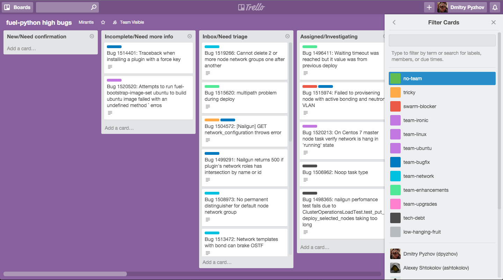

=============================
 Dealing with Launchpad bugs
=============================

Dealing with bugs on Launchpad can be ineffective if you have more then 10 open bugs at once.
And it creates real headache if you have about 1000 bugs.
It is hard both from day-to-day life and from metrics point of view. Here you can find
helpers that are intended to make your life easier.

Trello export
-------------

You can export you bugs into Trello online board. You can have several boards for different subsets of bugs.

Features:

- Separate columns for each state
- Separate column for bugs with 'blocked' tag
- Separate column for fixes on review
- Integration with OpenStack Gerrit
- Basic team management via bug tags
- Bug filtering

Usage:

  lpgrabber trello --filter filter --project project --board [board name]
  --trello-key trello-key --trello-secret trello-secret --trello-token trello-token

filter - a JSON with params for searchTasks. You can find full list of params in `API documentation`_

.. _API documentation: https://launchpad.net/+apidoc/devel.html#bug_target

You can provide several filters if you want.

project - name of your Launchpad project. You can provide several projects

board - name of your Trello board. You can use --create-board key in order to create a board if it doesn't exist

trello-key, trello-secret and trello-token are needed in order to authenticate you.
You should get key and secret on https://trello.com/app-key and generate a token with
``https://trello.com/1/connect?key=YOUR_TRELLO_KEY&name=bugfix-app&response_type=token&scope=read,write&expiration=never``
url. Replace YOUR_TRELLO_KEY with real value

CSV export
----------

Download Launchpad project information in csv format suitable for data analysis with pandas.
Report contains columns for each milestone. You can find example of report script in reports directory.

Usage:

  lpgrabber [--milestone X.X] [--updated-since YYYY-MM-DD] [--open-only] bugs project_name

  lpgrabber teams search_string

Remove duplicated tasks
-----------------------

Launchpad has 'development focus' series and works with it poorly. Automated tools can be misleaded about task status.
This command removes extra tasks from bugs where possible.

Usage:

  lpgrabber [--open-only] killdupes [--dry-run] [--dont-delete] [--next-focus next_series]

open-only - don't touch closed bugs. It is needed if you want to preserve fix dates

dont-delete - Do not remove tasks. Doesn't help with duplication. Only update hidden tasks with actual status. Useful for closed tasks.

next-focus - Don't delete task from current development focus if it is nominated for next development focus.

Contribution
------------

You are welcome to contribute your ideas and your code. My e-mail is dpyzhov@mirantis.com

There is no bug tracker for this tool for now. And there is no blueprint management.

Here is the list of future plans. Not all of them will be implemented:

- add some speed by running requests in parallel
- unit tests with mocks for main cases
- implement --reviews-list and --history flags for bugs
- implement gerrit integration
- assignee mapping
- ability to customize columns rules from the command line
- option for frequent updates using modified_since filter
- don't show title and description for private bugs on public boards
- sort bugs within one column basing on tags and priorities
- add kanban counters to list titles in the format [now/max]
- unarchive a card if related bug gets back to scope
- archive default lists and delete labels during board creation
- enhance card description with status, age, last update date, detailed review status
- user and developer friendly error handling
